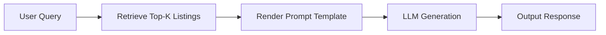

# Rag_aprtments.com

# RAG-Apartments: Retrieval-Augmented Generation for Apartment Listings

<p align="center">
  
</p>

---

## 📖 Table of Contents

1. [Overview](#-overview)
2. [Key Components](#-key-components)
3. [Data & Templates](#-data--templates)
4. [Architecture](#-architecture)
5. [Usage](#-usage)
6. [Folder Structure](#-folder-structure)
7. [Installation](#-installation)
8. [Contributing](#-contributing)
9. [License](#-license)

---

## 🔍 Overview

The **RAG-Apartments** application enhances apartment search by combining vector retrieval of property data with LLM-based generation. When a user queries for apartment recommendations, the system:

1. Retrieves relevant entries from `properties.csv` via vector embeddings.
2. Injects retrieved facts into a response template.
3. Generates a natural language summary with an LLM.

<p align="center">
  
</p>

---

## 🔑 Key Components

* **Document Store:** CSV file (`properties.csv`) containing apartment metadata.
* **Vector Index:** Embeddings generated for each listing and stored for similarity search.
* **Templates:** Jinja2 templates for consistent response structure.
* **Retrieval Module (`Rag_file.py`):** Handles embedding lookup and top-k retrieval.
* **Generation Module:** Feeds retrieved context + user prompt into an LLM (e.g., OpenAI GPT) to produce final text.

<p align="center">
  
</p>

---

## 🗂 Data & Templates

* **properties.csv:** Contains columns like `id`, `location`, `price`, `bedrooms`, `amenities`, `description`.
* **templates/**: Directory of Jinja2 `.jinja` templates for formatting the LLM prompt and output.

<p align="center">
  
</p>

---

## 🏗 Architecture



<p align="center">
  
</p>

---

## 🚀 Usage

```bash
# Run retrieval & generation
python Rag_file.py --query "2-bedroom apartments near downtown under $2000"

# Sample output saved as output.txt:
# "Sure! Here are the top 3 apartments: ..."
```

Customize response style by editing the Jinja templates in `templates/`.

---

## 📁 Folder Structure

```bash
Rag_implementation/
├── templates/              # Jinja2 templates for prompts & responses
├── Rag_file.py             # Main retrieval & generation script
├── properties.csv          # Apartment listing dataset
├── requirements.txt        # Python dependencies
└── README.md               # This file
```

---

## ⚙️ Installation

```bash
git clone https://github.com/Vishnucreate/Rag_apartments.com.git
cd Rag_implementation
python -m venv venv
source venv/bin/activate  # or venv\Scripts\activate on Windows
pip install -r requirements.txt
```

---

## 🤝 Contributing

Contributions welcome:

* Add new templates for different response styles
* Integrate with alternative vector stores (e.g., Pinecone)
* Experiment with fine-tuned LLMs

---

## 📄 License

MIT License. See [LICENSE](LICENSE) for details.
